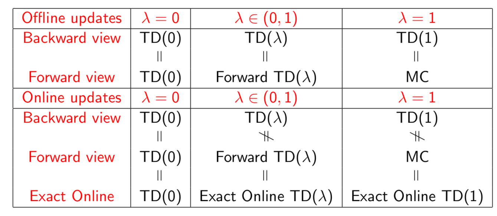

# Comparison of Algorithms
## Monte Carlo Methods
### v.s. DP 
- Model free, they learn from experience.
- They can be easily used with simulation or sample models (see Chapter 8), since state transition probability for DP is hard to obtain.
- MC methods can focus on a subset of states, while DP usually update all states.
- Since they don't bootstrap, they may be less harmed by violating the Markov assumption.

## One-Step TD Methods
### v.s. DP
One-Step TD methods are model free, and computationally simle.

### v.s. Monte Carlo

- Online update, don't need to wait until the end of each episode (i.e. MC methods are off-line), thus learn quickly.
- Suitable for continuing tasks, while MC only works in episodic cases.
- Practically TD methods converge faster than MC with constant step size (we don't have theoretical proof yet).
- Bias/Variance Trade-Off
    - MC uses true returns (which is an unbiased estimate for the value for a given state), whereas the target in TD is biased
    - TD target has lower variance than MC, since ture return depends on many random actions, transitions and rewards, while TD target only relies on **one**
- Markov property
    - TD exploits Markov property while MC does not, thus MC can be more effictive in non-Markov environments

### v.s. N-Step TD Methods
They lie between one-step TD and MC methods, usually better than the extremes. N-Step TD methods require more memory to record the states, actions and rewards than one-step methods.

## TD(𝝺) 
- Offline 𝝺-return algorithm, still does offline update, i.e. learn until the end of each episode. It's a forward view of the learning process.
- Using eligibility traces, we can make a backward view of the learning algorithm, which also enables online update. Note that we can also accumulate the TD error at each timestep, and only do update at the end of episode, which creates a offline version for TD(𝝺).
- Forward view is a theoretical solution for the task, while backward view (online update) is an efficient and practical approximation towards that. But while using the Dutch Traces, at least in linear function approximation problems, we have proven that backward view and forward view are equivalent, which induces [true online TD(𝝺)](http://citeseerx.ist.psu.edu/viewdoc/download?doi=10.1.1.487.2451&rep=rep1&type=pdf) method.

- Comparison between 𝝺:
    - 𝝺 = 1, the offline 𝝺-return algorithm and the TD(1) with offline update exact equals MC, but TD(1) with online update only approxmates MC. 
    - 𝝺 = 0, both offline and online update are exactly the same as one-step TD method.

See the Table for a general comparison, which is derived from David Silver's [silde](http://www0.cs.ucl.ac.uk/staff/d.silver/web/Teaching_files/MC-TD.pdf).

### v.s. One-Step TD Methods
Both TD(𝝺) and One-Step TD methods update at each timestep. 

- When using eligibility traces in TD(𝝺), additional computation is introduced. But they leverage the data from experiences more efficiently, since the targets more than one-step are combined.
- One-Step TD Methods are suitble for the scenarios with adequate data (or data is cheap to generate), while TD(𝝺) is good with cases with limited data.

## Policy Gradient Methods
- They can approx any determinstic policy, while tabular methods can't via an eps-greedy policy. 
    - action preference can be an arbitrary value.
    - whereas the Q or V function has certain meaning in action-value based methods.

- They enable the selection of actions be an arbitrary probability. 
    - if u wanna do the same thing on tabular methods, we might end up with an awkward value of eps.
- The policy may be a simpler function to approximate than action-value funtions.
- They are natural to inject prior knowledge into policy.